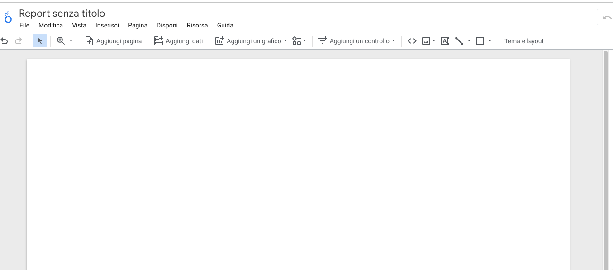

---

title: "Che cos'è Looker Studio (ex Datastudio)"
summary: "Che cos'è Looker Studio? Che cosa bisogna conoscere per utilizzarlo al meglio? Parliamone"
cover:
    image: "appunti-digital-analytics.png"
    caption: "Appunti Digital Analytics"
    alt: "Capi Facebook Stape"
categories: 
    - "Appunti Digital Analytics"
tags:
    - "GA4"
date: 2023-04-24
---

L'intento 

## Che cos’è Looker Studio

Data Studio è uno strumento di Data Visualization. Inglesismi a parte, significa che è uno strumento che possiamo utilizzare per visualizzare i nostri dati in modo organico.

In Looker Studio possiamo creare dei “Report” in cui inserire dinamicamente testo, immagini, grafici, tabelle. Non si tratta però di report statici, ma al contrario di report personalizzabili, filtrabili e con cui è possibile interagire. 

Possiamo cioè costruire delle esperienze di lettura dei dati super interessanti. 

## Vantaggi e Svantaggi di Looker Studio

In giro per internet esistono tantissimi competitor di Looker studio, tuttavia, quest’ultimo ha dei vantaggi: 

* Si tratta di uno strumento **gratuito**, realizzato da Google e messo a disposizione di tutti gli utenti. Nonostante esista una versione a pagamento di Looker Studio, la quasi totalità delle funzioni principali viene fornita gratuitamente. 
* E’ uno strumento che si integra alla perfezione con l’ecosistema Google. Possiamo cioè attingere in modo super semplice ai dati di Google Analytics, Google ADS e di tutti gli strumenti di Google. 
* La curva di apprendimento di Looker Studio è molto bassa. Anche senza alcuna conoscenza dello strumento, potremmo intuitivamente costruire delle semplici visualizzazioni dei nostri dati.

Naturalmente però, non è tutto rose e fiori, anzi, Looker Studio presenta anche numerosi problemi:

* Bug Fastidiosi
* Connettori di terze parti non sempre affidabili
* Possibilità di personalizzazione grafica non incredibile
* UX/UI discutibile sotto alcuni punti di vista

Insomma, si tratta comunque di uno strumento “estremamente potente” e “gratuito”, possiamo quindi passare sopra alcune di queste problematiche.

## Cosa bisogna conoscere per utilizzare Data Studio al meglio?

Questa è la domanda delle domande e in questi giorni me la sono posta più volte. Il problema di lavorare ad una formazione su uno strumento apparentemente così semplice come Looker Studio è che la complessità dello stesso non risiede nelle sue funzioni. 

I concetti principali di Data Studio possono essere compresi in pochi giorni e quelli più avanzati possono essere approfonditi on the job senza alcuna difficoltà. Tuttavia, il principale problema dello strumento sta nella sua versatilità.

Quando creiamo un report per la prima volta, Looker Studio ci mette di fronte ad una pagina simile a quella dello screenshot qui sotto. 

Una pagina bianca con nessuna struttura, totalmente personalizzabile. 

Trovarsi di fronte ad una tela bianca può far paura e devo ammettere che a distanza di anni spaventa anche me. 

Soprattutto, quando mantengo la cattiva abitudine di cominciare a costruire i miei report senza passare da una fase di progettazione.

Data Studio è uno strumento versatile. Al contrario dei suoi concorrenti non nasce per un obiettivo specifico, anzi, il suo scopo è quello di consentirci di costruire visualizzazioni di dati di ogni tipo. 

Nel corso di questi anni l’ho utilizzato per: 

* Costruire report di analisi di e-commerce
* Costruire report di analisi di UX/UI
* Costruire report di analisi SEO
* Visualizzare l’andamento delle mie spese personali
* Costruire visualizzazioni sull’andamento della mia attività
* Visualizzare i risultati delle mie attività sui social media
* Monitorare tramite visualizzazioni ad Hoc lo stato dei miei progetti

Potrei continuare ancora a lungo, ma questa breve lista dovrebbe rendere chiara una cosa: la principale difficoltà di utilizzare uno strumento come Data Studio, non risiede nello strumento in sé quanto nella natura e nella conoscenza dei dati tracciati. 

Se dovessi sintetizzare quanto compreso in questi anni, direi che per la costruzione di una buona dashboard sono necessari gli elementi indicati qui sotto. 

### Conoscenza del dominio dei dati da visualizzare

Costruire visualizzazioni con dati provenienti da un dominio di cui non si ha una buona conoscenza è difficile se non impossibile. Questa è una lezione che ho imparato durante quest’ultimo anno. 

Il mio coinquilino si occupa di attività di ricerca presso l’università. Ed in particolare di ricerca in campo biologico. Tra le sue attività si occupa anche di analizzare dati e costruire visualizzazioni. 

Confrontandomi spesso con lui mi sono accorto che nonostante la mia esperienza, non saprei da cosa partire per creare delle visualizzazioni intelligenti di dati biologici. 

Ed il motivo è semplice: per me, sarebbero soltanto dei dati sterili. 

Per costruire dashboard coerenti è necessario comprendere fino in fondo la natura dei dati da visualizzare.

### Comprendere i destinatari del report

Il fruitore finale delle nostre rappresentazioni influenza enormemente la costruzione delle nostre dashboard. 

Costruire una dashboard per consentire ai nostri clienti la lettura dei dati delle campagne senza la necessità di entrare all’interno delle singole piattaforme è molto diverso dalla costruzione di una dashboard di analisi (sempre delle campagne) destinata però agli advertiser o allo strategist. 

L’interlocutore della nostra visualizzazione cambia il modo in cui costruiremo il nostro report. E questo è uno dei principi cardine della comunicazione, non solo della data visualization. 

Su di un report destinato al cliente finale, probabilmente inserirò più testo a contorno in modo da introdurre le visualizzazioni tramite didascalie o altri elementi di corredo. 

In una dashboard destinata invece ad uso interno, inserirò probabilmente poco testo ma al contrario ci sarà un’abbondanza di visualizzazioni e filtri che consentano a tutti di modificare la visualizzazione per indagare i dati al meglio. 

Insomma, comprendere i destinatari finali di un report è essenziale per costruire visualizzazioni efficaci. 

### Pensalo prima, fallo poi

Questa è l’ultima regola / cosa da conoscere per costruire buoni report. Oddio, in realtà ci sarebbe ancora tanto da dire, ma qui inserirò solo le cose che avrei voluto sapere qualche anno fa. 

Qualsiasi Dashboard va prima pensata, progettata e analizzata pagina su pagina. Partire da un buon progetto ci assicura di essere molto più veloci nella costruzione della reportistica e ci consente di evitare sprechi di tempo. 

Ad oggi, la costruzione delle Dashboard è la cosa che mi ruba più tempo in assoluto, ecco perché è di vitale importanza, progettare la Dashboard in ogni suo elemento al fine di evitare sprechi di tempo. 

## Conclusioni

All'interno di questo post avevo promesso di parlare di Looker Studio. In realtà, sono venute fuori tutta una serie di considerazioni sullo strumento che spero possano servire da ispirazione.

Se ti è stato anche vagamente utile, ti chiedo di condividerlo con la tua rete e di farlo girare sui social. 


    
Se hai bisogno di un report o vuoi supporto nella realizzazione di quest'ultimo, contattami direttamente dal mio sito <a href="https://enricochiolo.com">Qui</a>

