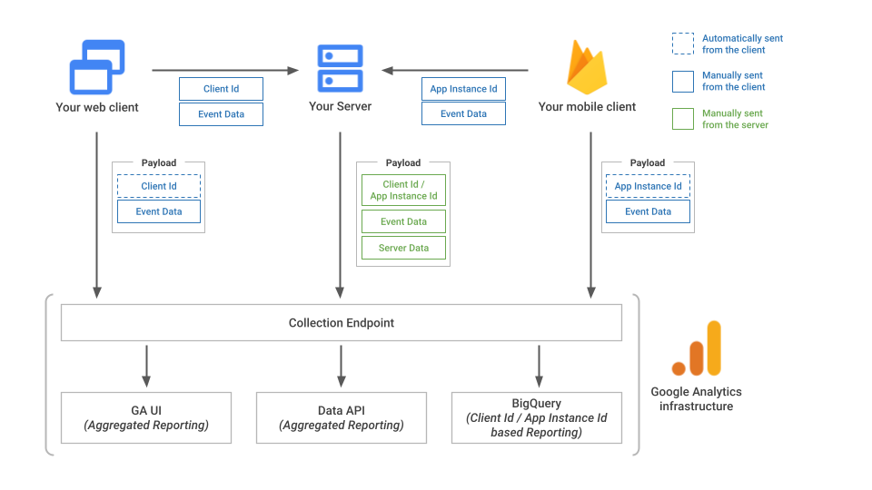
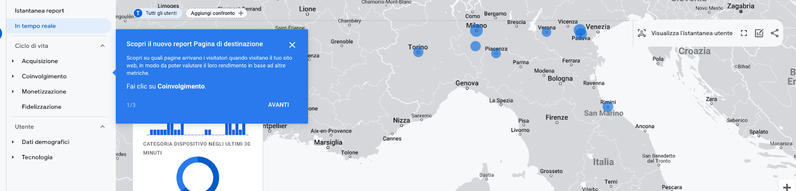

---

title: "Appunti sul Measurement Protocol di GA4"
summary: "Ho aiutato alcuni clienti ad inoltrare eventi lato server con GA4. Per farlo, abbiamo utilizzato il Measurment Protocol. Ho preso un pò di appunti che vorrei condividere con te"
cover:
    image: "appunti-digital-analytics.png"
    caption: "Appunti Digital Analytics"
    alt: "Capi Facebook Stape"
categories: 
    - "Appunti Digital Analytics"
tags:
    - "GA4"
date: 2023-04-05T11:30:03+00:00
---

## Introduzione
Secondo la documentazione ufficiale di Google, il Measurement Protocol per Google Analytics 4 consente agli sviluppatori di migliorare gli stream web e delle app inviando eventi direttamente ai server di Google Analytics tramite richieste HTTP.

In pratica, questo significa che possiamo inoltrare eventi a Google Analytics utilizzando semplici richieste HTTP, senza l'ausilio diretto delle librerie di Google Analytics. 

Ciò è particolarmente utile per inoltrare eventi lato server o conversioni offline a Google Analytics. 

Ad esempio, il protocollo potrebbe essere utilizzato per inoltrare eventi purchase basati sul rinnovo automatico di abbonamenti o in tutte quelle situazioni in cui non c'è un'interazione diretta da parte dell'utente. 

Inoltre, il protocollo potrebbe essere utilizzato in sistemi in cui il lead viene lavorato all'interno di un CRM e la conversione avviene in realtà fuori dalla parte web.

In particolare, Google ci dice che gli sviluppatori possono utilizzare Measurement Protocol per:
* Collegare il comportamento online a quello offline;
* Misurare le interazioni lato client e lato server;
* Inviare eventi che si verificano al di fuori dell'interazione utente standard (ad es. le conversioni offline)
* Inviare eventi da dispositivi e applicazioni in cui la raccolta automatica non è disponibile (ad esempio kiosk, orologi e così via).

⠀Convalidare & Testare gli eventi
Per testare gli eventi, è possibile utilizzare l'Event Builder per GA4, che permette di costruire l'evento, aggiungere i parametri e verificare sia il payload che l'inoltro delle informazioni. 

~[https://ga-dev-tools.google/ga4/event-builder/](https://ga-dev-tools.google/ga4/event-builder/)~

Tuttavia, gli eventi inviati tramite Measurement Protocol non sono di solito visualizzati nella console di debug, a meno che non si aggiunga il parametro "debug_mod" con valore 1. 

In questo modo, gli eventi verranno visualizzati sulla console di debug. Inoltre, è importante che il client_id sia valido e presente all'interno di GA4, e questo valore può essere recuperato direttamente dal browser, considerando la stringa composta da 20 caratteri separati da un punto.

## Panoramica sull’architettua
L’immagine qui sotto illustra una panoramica dell’architettura-

## Alcune Avvertenze
### Remarketing
Quando Google Signals è attivato, è supportato il remarketing per lo stesso dispositivo. Per il remarketing cross-device è necessario un ID utente aggiuntivo
### Informazioni Geografiche
Le informazioni geografiche sono disponibili solo tramite la raccolta automatica da gtag, Google Tag Manager o Google Analytics per Firebase.
### Inoltrare solo eventi tramite il protocollo di misurazione
Anche se è possibile inviare eventi a Google Analytics solo tramite il protocollo di misurazione, potrebbe essere disponibile solo una parte dei report. Lo scopo del protocollo di misurazione è quello di integrare gli eventi esistenti raccolti tramite gtag, GTM o Firebase.

Il protocollo di misurazione non sostituisce l'inoltro di eventi tramite i metodi più tradizionali, ma è un supporto necessario per l'integrazione di eventi aggiuntivi, in quanto è soggetto a alcune importanti limitazioni.

## Inviare eventi a GA4 tramite Measurement Protocol
Per l’inoltro di eventi a GA4 è necessario effettuare una richiesta HTTP di tipo POST al seguente endpoint:

POST /mp/collect HTTP/1.1
HOST: ~[www.google-analytics.com](http://www.google-analytics.com/)~
Content-Type: application/json
<payload_data>
### Parametri Obbligatori
Per inoltrare le richieste tramite il Measurement Protocol, è necessario specificare alcuni parametri. Questi possono variare a seconda che si utilizzi Firebase o gtag.js.

Momentaneamente, osserviamo solo i parametri obbligatori quando si utilizza il tag di Google e non Firebase. 

**api_secret** - Obbligatorio. Un elemento API SECRET generato nell'interfaccia utente di Google Analytics. Per creare un nuovo secret, vai a:
Amministratore > stream di dati > scegli il tuo stream > Measurement Protocol > Create

**measurement_id** - Obbligatorio. L'ID misurazione associato a uno stream. Nell'interfaccia utente di Google Analytics in:
Amministrazione > stream di dati > scegli il tuo stream > ID misurazione

Ora, l’api_secret e il mesaurement_id possono essere recuperati entrambi in modo abbastanza semplice direttamente dalla nostra proprietà di GA4. Le cose si complicano un poco per quanto riguarda invece il body della nostra richiesta HTTP.
Per quanto riguarda invece il corpo del JSON della richiesta è necessario inoltrare le seguenti informazioni:
* **client_id** - Obbligatorio. Identificatore univoco di un client.
* **user_id** - Facoltativo. Identificatore univoco di un utente. Per ulteriori informazioni su questo identificatore, consulta la pagina ~[User-ID per l'analisi multipiattaforma](https://support.google.com/analytics/answer/9213390?hl=it)~.
* **events** - Obbligatorio. Un array di elementi evento.

##### Recuperare il Client ID
Per quanto riguarda il client_id, quest'ultimo deve essere recuperato e memorizzato da qualche parte. 

Ma andiamo con ordine: il client_id è un identificativo univoco dell'utente. Generalmente, viene memorizzato all'interno del cookie _ga del browser dell'utente e identifica l'utente in tutte le sue sessioni effettuate con lo stesso browser. 

Utilizzando un'estensione del browser che consente di visualizzare i cookie, è possibile leggere il valore assegnato al client_id. 

Tuttavia, attenzione: il client_id è il valore numerico composto da 20 caratteri seguito dal punto "." e dalla porzione iniziale "GA1.1." È possibile recuperare il client_id dell'utente anche utilizzando la funzione gtag() con il metodo get, come descritto nella documentazione.

```js
gtag('get', 'G-NW1BQ5DLJC', 'client_id', (clientID) => {  console.log("Questo è il client id:"+clientID)  });
```
 
Nell’esempio sopra, il client_id viene recuperato tramite la funzione gtag(‘get’) e viene stampato nella console di Javascript. 

Per garantire la corretta elaborazione degli eventi del Protocollo di Misurazione, è necessario che il client_id sia presente in GA4. 

Pertanto, se si inoltrano conversioni offline, è importante memorizzare ed inviare il client_id al nostro CRM. In questo modo, saremo in grado di ricostruire anche le eventuali conversioni avvenute offline. Questo è uno step di vitale importanza.

**Nota**: Non ho ancora eseguito sufficienti test per comprendere cosa accade se il client_id non viene recuperato correttamente. Dalle prove effettuate, posso tuttavia assicurare che se il campo debug_mode viene impostato su 1 e il client_id non è presente in GA4, gli eventi non vengono visualizzati in Debug. Presumo che gli eventi vengano comunque ricevuti correttamente. Farò ulteriori test in futuro per verificare ciò.

**Eventi**
Il terzo parametro obbligatorio per l’inoltro della richiesta è il parametro events. Si tratta in realtà di un array di oggetti contenenti le informazioni sugli eventi.

Per quanto riguarda la tipologia di eventi inoltrabili, da quello che ho visto è possibile inoltrare sia eventi custom che eventi consigliati di GA4. 

Il mio consiglio, soprattutto per quanto riguarda la costruzione del payload è quello di utilizzare l’event builder di GA4 (trovate il link sopra) per generare degli eventi di prova da utilizzare come base. 
## Inoltrare un’evento
Qui sotto un esempio di richiesta http per l’inoltro di eventi tramite Mesaurement Protocol presa dalla documentazione ufficiale. E’ comunque possibile eseguire un test tramite la console del browser inoltrando alcuni eventi direttamente dal sito web. 
Naturalmente i campi mesaurement_id e api_secret vanno correttamente compilati, ma una volta fatto, è possibile osservare la vista in tempo reale sulla quale dovreste vedere gli eventi arrivare. 

```js
const measurement_id = `G-fdsfdsfds`;
const api_secret = `q-8ZC-kyfdsfdsfsdfds`;
 
fetch(`https://www.google-analytics.com/mp/collect?measurement_id=${measurement_id}&api_secret=${api_secret}`, {
  method: "POST",
  body: JSON.stringify({
  "client_id": "1395066687.1671008361",
  "non_personalized_ads": false,
  "events": [
    {
      "name": "subscription",
      "params": {
        "items": [
          {
            "item_id": "IDITEM",
            "item_name": "Rinnovo Abbonamento",
            "quantity": 1,
            "item_brand": "test",
            "item_category": "Abbonamento",
            "item_variant": "Variante Abbonamento",
            "price": 11,
            "currency": "EUR"
          }
        ],
        "currency": "EUR",
        "transaction_id": "000001",
        "shipping": 5,
        "tax": 4,
        "value": 11
      }

```

Una volta inoltrato l’evento dovreste vederlo arrivare sulla vista in tempo reale. 


In alternativa, aggiungendo il campo debug_mode = 1 + un client_id esistente, dovreste riuscire a vederlo all’interno della debug mode in modo abbastanza semplice. 

# Conclusioni
Inoltrare eventi tramite il Measurement Protocol di GA4 non è una cosa complicata.  Si tratta banalmente di effettuare una richiesta HTTP all’endpoint indicato compilando correttamente i vari parametri dell’evento. 

La vera sfida, in questo caso, sta proprio nella compilazione del body della richiesta. Affinché l’inoltro di eventi abbia senso, è necessario gestire in modo adeguato sia il client_id che lo user_id.

Nonostante quest’ultimo non sia un parametro obbligatorio è in realtà fondamentale per poter ricostruire il percorso di acquisto di un utente.

Ecco perché, in questo caso la sfida non è tanto tecnologica quanto organizzativa. Il processo di analisi va strutturato a monte, in modo da avere ben chiare le informazioni da inoltrare tramite richiesta HTTP. 

In realtà ci sarebbero anche altre piccole cose da considerare per l’inoltro, tuttavia, la documentazione ufficiale è ben scritta, quindi per tutto il resto, vi rimando a quella. 

 

