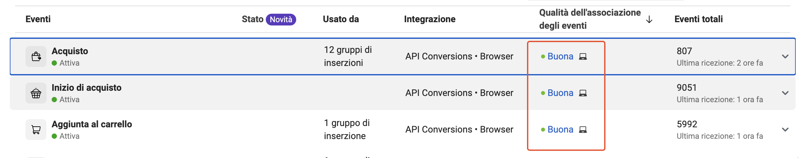
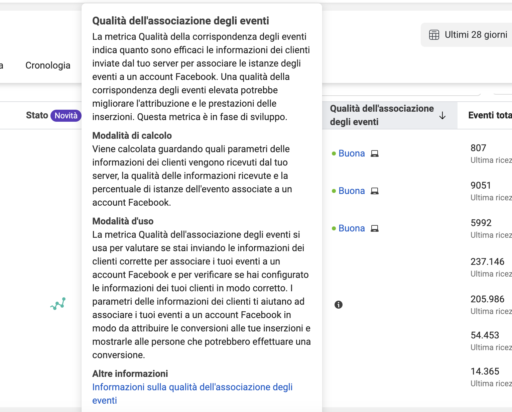
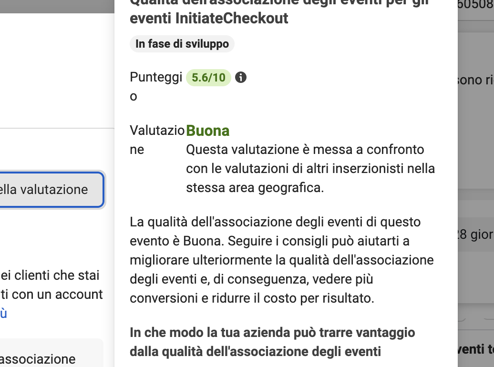

---

title: "Qualità dell’associazione degli eventi per il pixel Meta: come funziona e come migliorarla"
summary: "Che cosa vogliono dire i puneggi accanto agli eventi che Meta mostra in events manager? Scopriamolo insieme"
cover:
    image: "appunti-digital-analytics.png"
    caption: "Appunti Digital Analytics"
    alt: "Facebook"
categories: 
    - "Appunti Digital Analytics"
tags:
    - "Tracking Meta"
date: 2023-07-08T11:30:03+00:00
---
Questa mattina, un caro collega mi ha chiesto di fare chiarezza sul punteggio di qualità dell'associazione degli eventi del Pixel di Meta. 

Se non sai di cosa sto parlando, mi riferisco ai punteggi che puoi vedere su Events Manager accanto ai tuoi eventi. 

Per essere più precisi, quelli evidenziati nello screenshot qui sotto:

Nota, alcune visualizzazioni potrebbero essere un pelino differente, ma non cambiano le considerazioni espresse all'interno di questo post

Questi punteggi, molto spesso, sono fonte di grande confusione per gli utenti. Ne sono ben consapevole, dato che ricevo frequentemente segnalazioni da potenziali clienti preoccupati per i loro punteggi di qualità. 

Ora, facciamo chiarezza su un aspetto: se il punteggio di qualità dei tuoi eventi non è ottimo, non è necessariamente una catastrofe e, soprattutto, a volte non c'è molto che tu possa fare al riguardo.

Chiarito questo aspetto, procediamo con il capire: 
* Cosa vuol dire quel punteggio
* Da cosa dipende
* Cosa possiamo fare per influenzarlo
* Come valutarlo correttamente
## Che cosa intende Meta con qualità dell'associazione degli eventi?
Una prima risposta ci viene fornita da Meta attraverso un popup. Per visualizzarlo, basta posizionare il mouse sulla prima riga della tabella, come illustrato nello screenshot qui sotto.

Analizziamo ciò che Meta ci comunica riguardo ai punteggi assegnati a quella colonna.

La metrica Qualità della corrispondenza degli eventi, indica quanto sono efficaci le informazioni dei clienti inviate dal tuo server per associare le istanze degli eventi a un account Facebook. 

## Cosa ci sta comunicando esattamente Meta con questa affermazione?
Per capirlo, prendiamo un esempio. 
Chiedo indulgenza ai miei colleghi se semplifico un po' la questione, ma è essenziale per una piena comprensione.

Ogni volta che inviamo un evento ai server di Meta, i suoi sofisticati algoritmi si mettono all'opera per identificare l'utente che ha innescato l'evento e, in particolare, cercano di associarlo ai dati sugli utenti di cui già dispongono.
Il principale obiettivo di Meta è creare una corrispondenza tra le informazioni che stiamo inviando e quelle già in suo possesso.

Ma perché è così vitale? Perché, grazie ai dati condivisi, Meta è in grado di riconoscere l'utente e, di conseguenza, attribuire correttamente eventuali conversioni.

Ancora più importante, può formulare ipotesi più precise sulla tipologia di utenti che desideriamo raggiungere con i nostri obiettivi di campagna.

Il punteggio visualizzato in quella colonna rappresenta quindi l'efficacia di questa corrispondenza, ossia la percentuale di utenti che Meta è riuscita a identificare grazie alla trasmissione delle informazioni sull'utente.
## Cosa influenza il punteggio di qualità di associazione degli eventi Meta? 
Per semplificare, il punteggio di qualità di associazione degli eventi è influenzato dal numero di informazioni sull'utente trasmesse attraverso gli eventi.

Se desideri migliorare questo punteggio, l'unico modo è trasmettere quante più informazioni sull'utente possibile.

Ovviamente, alcune informazioni sull'utente non sono disponibili per tutta la durata del percorso di acquisto. Dati come il nome, il cognome o l'indirizzo email saranno disponibili solo se l'utente ha effettuato l'accesso o ha compilato un modulo fornendoci tali informazioni.

Ora, il discorso è leggermente più complesso di così e lascia aperte alcune questioni di fondamentale importanza.

Alcune domande aperte sono: 
* Quali informazioni utente vanno inoltrate? 
* Come facciamo ad inoltrare le informazioni utente?
* Ma come viene calcolato esattamente il punteggio?
* Cosa succede se ho un punteggio scadente? 

Bene, allora mettiti comodo e continua la lettura, cercherò di fornirti tutte le informazioni utili per comprendere il punteggio di qualità dell'associazione degli eventi. 😇 O almeno ci proverò eh!

## Come viene calcolata la qualità di associazione degli eventi? 
Anche in questo caso ci viene in soccorso il popup visualizzato in events manager.
 
Viene calcolata guardando quali parametri delle informazioni dei clienti vengono ricevuti dal tuo server, la qualità delle informazioni ricevute e la percentuale di istanze dell'evento associate a un account Facebook.

Dal paragrafo precedente, abbiamo appreso che la qualità di associazione degli eventi è influenzata dal numero di proprietà utente condivise con gli eventi del Pixel che Meta riesce a correlare con le informazioni in suo possesso.

Tuttavia, il punteggio viene calcolato in un modo un po' complesso. Meta, in primo luogo, esamina quali parametri vengono ricevuti, successivamente valuta la qualità delle informazioni ricevute e infine la percentuale di istanze dell'evento associate a un account Facebook.

In sostanza, non basta inviare informazioni sull'utente, queste devono anche soddisfare alcuni requisiti di qualità e, soprattutto, devono poter essere associate agli account Facebook, ovvero alle informazioni conservate da Meta.

Ovviamente, Meta non può fare molto con le informazioni sull'utente che non riesce a correlare con le informazioni in suo possesso. Le informazioni sull'utente devono permettere a Meta di collegare gli eventi a un account specifico.

Solo in questo modo il sistema funzionerà correttamente e potremo ottenere punteggi più elevati.

La qualità della corrispondenza viene calcolata tramite un punteggio da 1 a 10. Tuttavia, il punteggio effettivo è spesso visibile solo entrando sui singoli eventi. 

Più semplicemente, all’interno del pannello è possibile leggere i seguenti punteggi: 

* **Scarsa**: le informazioni dei clienti che invii con l'evento non sono efficaci per associarlo a un account Meta.
* **Ok**: le informazioni dei clienti che invii con l'evento sono solo parzialmente efficaci per associarlo a un account Meta.
* **Buona**: le informazioni dei clienti che invii con l'evento sono efficaci per associarlo a un account Meta.
* **Eccellente**: le informazioni dei clienti che invii con l'evento sono solo molto efficaci per associarlo a un account Meta.

 
## Quali parametri influenzano la corrispondenza? E in che modo?
A questo punto dell'articolo, molte delle perplessità sulla qualità della corrispondenza dovrebbero essere state risolte. Tuttavia, è ancora necessario approfondire alcuni aspetti riguardanti i dati utente da trasmettere. 

Non tutti i dati utente hanno lo stesso peso e, soprattutto, lo stesso formato. In questo contesto, Meta ci fornisce un [elenco dei dati utente ](https://www.facebook.com/business/help/765081237991954?id=818859032317965)che possiamo trasmettere e il loro impatto nel migliorare il punteggio di qualità.

Naturalmente, in testa fra tutti abbiamo informazioni quali: 
* L’indirizzo Email
* Il numero di telefono 
* L’indirizzo IP

Ma naturalmente sono ben accetti anche altri parametri come: 
* Il nome
* Il cognome
* Telefono
* Genere

Per un elenco di tutti i campi che è possibile inoltrare è sufficiente visitare la documentazione ufficiale per sviluppatori [qui](https://developers.facebook.com/docs/meta-pixel/advanced/advanced-matching).
### Quali parametri inviare sempre? 
Sulla base della mia esperienza, alcuni parametri devono essere inviati costantemente durante tutti gli eventi del percorso di acquisto. Per tutti gli altri, l'unica cosa che possiamo fare è inviare i parametri quando sono disponibili. 

Ovviamente, nel caso in cui l'utente sia loggato, è possibile e doveroso trasmettere sempre tutte le informazioni che abbiamo a disposizione.

In genere, alcuni parametri sono sempre e comunque facilmente recuperabili. Tra questi abbiamo: 
* Indirizzo IP
* User Agent
* FBC
* FBQ

## Conclusioni
Con questo articolo, spero di avervi aiutato a comprendere meglio quei misteriosi punteggi su Events Manager. Sebbene si tratti di un dato interessante che vale la pena migliorare, la maggior parte delle volte non è possibile influenzare direttamente questi punteggi.

Una possibile soluzione potrebbe essere quella di modificare il percorso di acquisto per incoraggiare l'utente a fornirci i suoi dati. Tuttavia, è importante considerare anche il tasso di conversione.

Non ha molto senso peggiorare il tasso di conversione delle nostre proprietà solo per migliorare il punteggio di qualità. Quindi, come sempre, valuta attentamente le tue mosse.