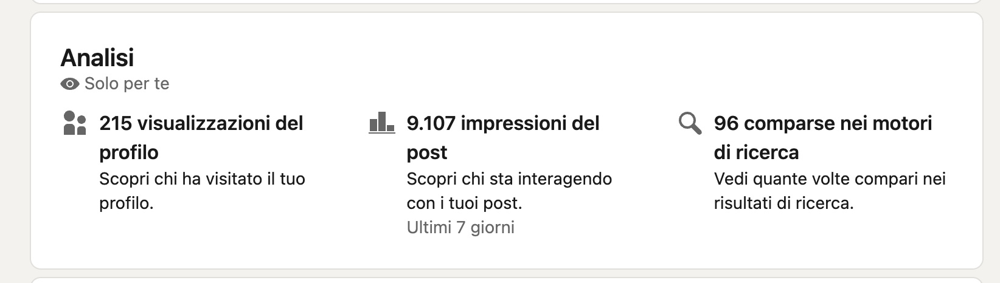
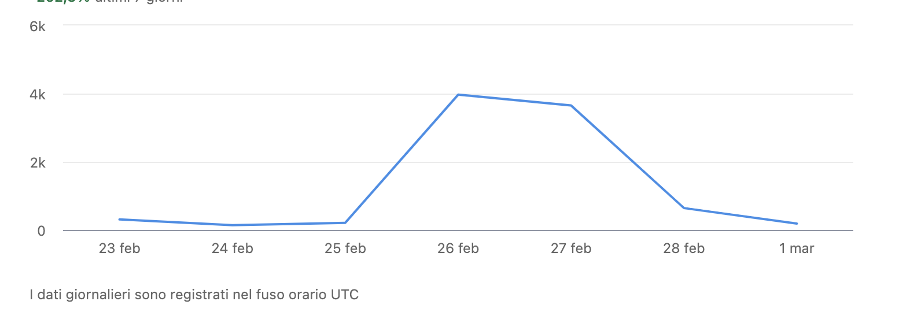
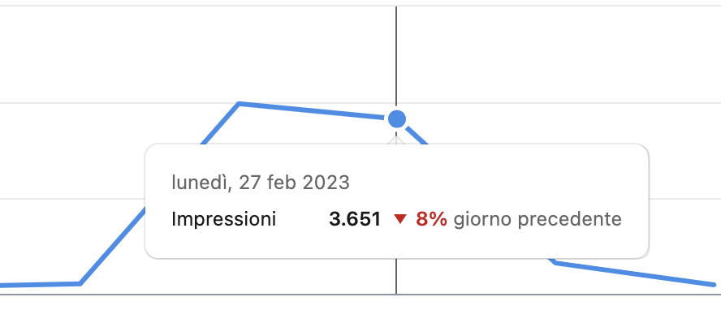

# Recuperare le Analytics personali di Linkedin con uno script

In questi ultimi giorni mi sono confrontato con un problema interessante riguardante l'export delle Analytics dal mio profilo LinkedIn. 

Ho avuto infatti la necessità di esportare i seguenti dati: 

- impressioni, 
- visualizzazioni del profilo
- interazioni. 

L'obiettivo era di recuperare e monitorare questi dati per qualche giorno.

Tuttavia, a differenza di Facebook, LinkedIn non consente un'export semplificato di questa tipologia di dati. 

Ma andiamo con ordine...

## Il problema con Linkedin

Appena iniziato, mi sono subito reso conto di avere qualche problema con Linkedin. Il social di Microsoft dispone infatti di una sezione relativa alle analytics del profilo personale, ma non permette l'export di questi dati. 

In particolare, tali dati sono raggiungibili dalla visualizzazione del profilo, come indicato nello screenshot qui sotto. 

|  |
|:--:|
| Figure 1 - Sezione del profilo linkedin da dove è possibile raggiungere le Analytics |

Cliccando su uno dei tre elementi, è possibile vedere i grafici, selezionare le metriche, visualizzare degli approfondimenti; ma non è possibile effettuare alcun export. O almeno, io non ho trovato una soluzione.

Tra l'altro, dopo un pò di ricerche mi sono reso conto che non esiste neanche un connettore a pagamento che consenta l'import dei dati del profilo personale su Datastudio o Google Sheet. 

Gli unici connettori presenti, da quello che ho potuto vedere, consentono di effettuare l'esportazione dei dati sulle pagine, ma non quelli del profilo personale.

Avevo inizialmente iniziato a ricopiare a mano i dati di impressioni e interazioni giorno per giorno. 

Un lavoro di merda; ammettiamolo. 

|  |
|:--:|
| Figure 2 - Grafico da cui stavo iniziando a copiare i dati giorno per giorno |

Dopo i primi cinque minuti, mi ero già stancato di farlo e di conseguenza ho aperto la console di Javascript del browser per cercare di capire se fosse possibile esportare quei dati in modo automatico. 

## La soluzione

Ho fatto un pò di test e sono arrivato ad uno script. 

C'è da dire che ci ho messo meno di una decina di minuti e che sicuramente ci sarebbero modi più intelligenti di gestire la cosa. 

Tuttavia funziona e per quelle che sono le mie attuali necessità può andare bene. Se qualcuno ha voglia di migliorarlo, aiutarmi a metterlo in un'estensione per Chrome o fare qualsiasi altra cosa, mi contatti. 

### Come funziona nello specifico

Il funzionamento dello script è semplicissimo, a dir poco banale. Lo script infatti recupera il testo dalle box visualizzabili al passaggio del mouse. 

|  |
|:--:|
| Figure 3 - Box che viene visualizzata al passaggio del mouse |

Una volta recuperati i dati, è possibile estrarre le informazioni principali, come ad esempio il giorno "27 Febbraio" e il numero di impressioni. 

Potrebbe anche essere utile calcolare la differenza percentuale con il giorno precedente, ma poiché si tratta di un dato calcolato, può essere calcolato direttamente in Sheet o su Datastudio.

Dopo aver recuperato i dati per tutti i giorni, questi vengono posizionati in un array e inizialmente postati nella console. Successivamente, ho modificato lo script in modo da inserire tutti i dati in un file CSV, che viene scaricato direttamente dalla console, semplificando ulteriormente il processo.

Per attivare lo script, è sufficiente copiarlo nella console di Javascript mentre si sta visualizzando la pagina con le Analytics. Una volta inviato, verrà automaticamente scaricato un file CSV contenente tutti i dati.

Questa è una soluzione grezza e abbozzata, ma funziona per le mie esigenze attuali. In futuro, potrebbe essere possibile trasformare il tutto in un'estensione per il browser, ma al momento penso che sia sufficiente.

Passando ora al codice dello script, ho commentato ogni parte, quindi dovrebbe essere facile da leggere e richiede solo una minima conoscenza di Javascript per poterlo comprendere.

### Il codice dello script

Il codice da inserire in console è quello qui sotto. Se ti interessa semplicemente testarlo, copialo e incollalo già all'interno della console per vederlo in azione. 

Se sei un programmatore o comunque sai scrivere del codice Javascript, ti chiedo invece di dargli un occhio e scrivermi per capire come migliorarlo e renderlo più affidabile. 

```javascript
// Selezioni tutti i box del grafico tramite QuerySelector
const dataPoints = document.querySelectorAll('path.highcharts-point');

// Creo array vuoto per salvare tutti i dati
const dataArray = [];

// Itera su ogni elemento path e recupera i dati dal loro attributo aria-label
// che contiene le informazioni da estrarre.
dataPoints.forEach((point) => {
  const label = point.getAttribute('aria-label'); //Recupero la label
  const labelParts = label.split(/,\s+/); // Splitto la label quando incontro " , " con gli spazi
  const giorno = labelParts[1].trim(); // Il giorno si trova nella seconda parte della label
  const impressioni = parseInt(labelParts[3]); // Le impressioni si trovano nella quart parte della label
  // Aggiungi giorno e impressioni all'array
  dataArray.push({ giorno, impressioni });
});

// Crea una stringa CSV contenente i dati
let csvData = 'Giorno,Impressioni\n';
dataArray.forEach((data) => {
  csvData += `${data.giorno},${data.impressioni}\n`;
});

// Crea un oggetto Blob contenente i dati in formato CSV
const blob = new Blob([csvData], { type: 'text/csv' });

// Crea un link di download per il file CSV
const link = document.createElement('a');
link.href = URL.createObjectURL(blob);
link.download = 'dati.csv';
link.click();
```
<p align = "center">Listing 1 - Script Recupero</p>


### Partiamo già con i primi bug

Lo script funziona perfettamente, ma solo in Italiano. Ho chiesto a Maurizio di provarlo e con la sua versione di Linkedin non è andato a buon fine. 

Se attualmente utilizzi Linkedin in Inglese hai sono due possibilità:

- Provare a debuggare un pò il codice (il problema dovrebbe essere nello split della label)
- Switchare Linkedin in Italiano

Se vuoi comunque provare a debuggare il codice non dovrebbe essere complicato. Io ci darò un occhio appena posso, ma sicuramente non sarà una cosa rapida, quindi, ti aspetto :) 

### Conclusioni

Mi ero ripromesso di essere breve e credo di esserci riuscito :) 

Spero che questo script possa esserti di supporto in qualche modo. Se hai apprezzato il post ed ho risolto un tuo problema, ricordati di condividerlo o inviami un feedback privato su Telegram. 

Un abbraccio. 

