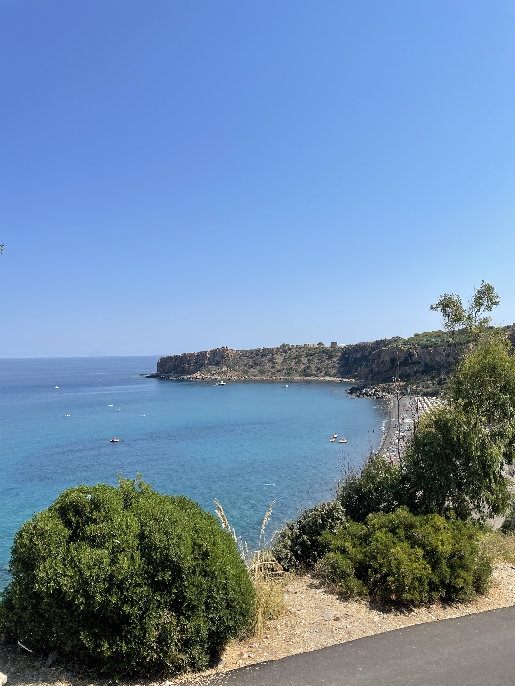

La prima settimana (abbondante) di [ferie](../23-luglio-22/) (che fa tanto medioevo chiamarle così, perciò tornerò a chiamarle vacanze) è andata ed io non ho rispettato tutti i miei buoni propositi. 

Lo ammetto, ho lavoricchiato qua' e la e in particolare ieri ho passato quasi tutto il giorno alla scrivania.

Me ne sono reso conto oggi, mentre osservavo scioccamente le mie board di Trello, (PS: ho parlato di come gestisco i miei task in [questo](../../produttivita/time-management-con-trello/) post) che avevo già riempito di circa 40 ore di cose da fare per questa settimana. 🧟‍♀️

Ma non importa, perché sono comunque riuscito a staccare qualche giorno e nonostante tutto, ho rallentato 🧘🏻 . Sto bene, e la dilatazione delle tempistiche mi ha permesso di guardare indietro al quadro generale. 

## 🔙 Non si torna indietro
Non ho alcuna intenzione di tornare ai ritmi precedente. Il gioco, in questo caso, non vale la candela. Non fraintendermi, probabilmente continuerò a fare roba per la maggior parte del tempo, ma voglio farlo più per me stesso che per gli altri. 

Negli ultimi 3 anni ho trascurato il mio fisico, alcuni interessi è un pò di curiosità. Non voglio che accada ancora, motivo per cui: **non si torna indietro**. 

Sicuramente questa seconda metà del mese di Agosto sarà ancora un pò calante (del resto si ferma tutta l'Italia praticamente) tuttavia io inizierò rispettando i miei tempi. 

## 😊 Che cosa significa essere felici
Questa è una di quelle riflessioni che potevo approfondire solo durante un momento di pausa. Perché sei lì, non stai più affrontando il tram tram della vita quotidiana e allora effettivamente ti chiedi davvero se sei felice e che cosa voglia dire per te esserlo. 

Io me lo sono chiesto e non ho trovato la risposta, ma di certo cercherò di ascoltare un pò di più i miei bisogni e le sensazioni di pancia, perché in fondo è giusto così. 

Ecco perché ho ricominciato il mio Journal privato su Day One, ed è un'abitudine che mi piacerebbe portare avanti. 

## 🙆‍♂️ Imparare e dare le giuste priorità
Questa è una cosa su cui devo assolutamente lavorare. Non sono bravo nel gestire le priorità. Non parlo di task lavorativi, in quelli riesco senza problemi, parlo di priorità di vita. 

Qui mi rifaccio ad una lezione del corso "Crea Tempo" di Andrea Giuliodori che sto rivedendo in questi giorni. 

La **domanda** da porsi è la seguente: 

> Se dovessi scegliere una sola cosa da fare che nei prossimi anni mi darebbe maggiori benefici, quale sarebbe? 

Di certo non rispondere alla mail di quel cliente, quanto piuttosto lavorare sulle mie competenze, comunicare di più, prendermi cura del mio corpo. 

Ne ho sbagliate di ogni in questi anni, e sono qui per ammettere pubblicamente di aver sbagliato, ma a dare le giuste priorità non si impara dall'oggi al domani, quindi sicuramente continuerò a sbagliare qualcosina. 

L'importante è continuare a correggere il tiro. 

E parte questo, direi che non ho altre illuminazioni da questa pausa, ma ti lascio ad un pò di materiale che ho consumato...

## 📖 Cosa sto leggendo

1) **Kafka sulla spiaggia - Murakami:** ho scoperto Murakami in questo 2022 e mi sono innamorato dell'autore. Sono ancora alle primissime pagine, ma il testo è scritto da Dio. C'è da dire che non penso di essere obiettivo quando si parla di Murakami. 
2) **L'almanacco di Naval Ravikant:** sto rileggendo questo libro stupendo. Ho anche scritto alcuni post sui social per consigliarlo, sicuramente merita davvero. 

## 🎶 Che cosa ho ascoltato?
Tanta musica, al solito tanto indie, ma questo è un elenco non esaustivo degli artisti che mi hanno accompagnato questa settimana. 

- Cimini
- Willi Peyote
- Zen Circus
- Rancore

## 🍿 Cosa ho visto?
Sto facendo un rewatch di **Ted Lasso**, l'ho ricominciato giusto ieri sera insieme alla mia ragazza e continuerò a guardarlo questa settimana. Una serie che è un elogio alla gentilezza e credo uno dei migliori prodotti di Apple in ambito televisivo. (lo affermo con la supponenza di chi non ne capisce un cazzo eh!)





