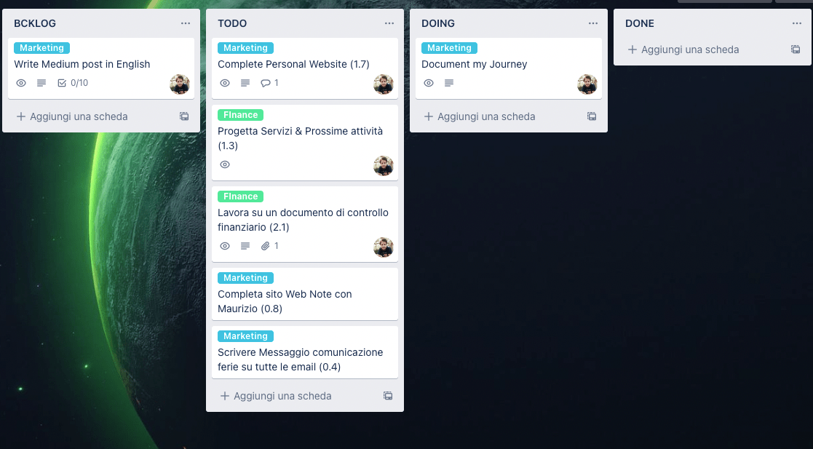
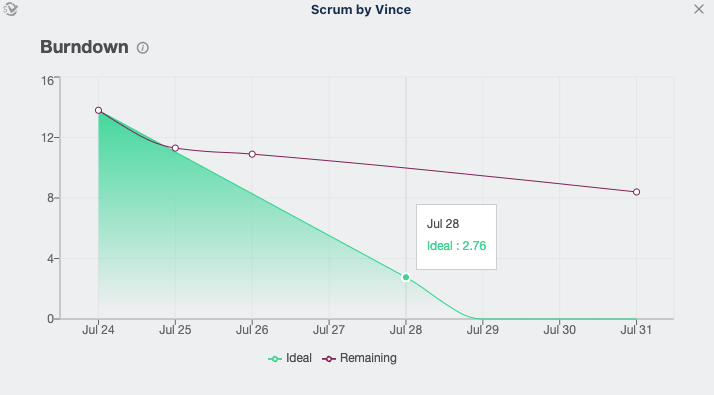

Ho sempre trovato [Trello](https://trello.com/) un pò fastidioso, lo ammetto. 

Tuttavia, per un motivo o per un altro, nell'ultimo periodo mi sono trovato costretto a spostare tutti i miei task all'interno di questo strumento. 

Ci ho giocato parecchio, ho fatto alcuni test e sono arrivato ad una struttura che pare funzionare. La sto utilizzando da circa due settimane senza particolari intoppi e nell'articolo di oggi vorrei spiegarti il mio **workflow** con lo strumento. 

## 🤥 Non solo trello
Per completezza, il mio Workflow non si basa esclusivamente su Trello, ma anche su Focus-To-Do che è però una semplicissima app per la gestione dei task tramite pomodori. 

Non si tratta però di un passaggio obbligatorio per il funzionamento del mio Workflow ed è piuttosto un elemento in più che potenzialmente potrei eliminare. 

Il **DISCLAIMER** in questo caso è d'obbligo, anche perché ti mostrerò tutto il metodo senza fronzoli, quindi non vorrei confonderti introducendo una nuova app nel corso dell'articolo. 

## 🔴 Le mie liste su Trello
Cominciamo subito parlando della gestione delle liste. Ho deciso di utilizzare un approccio a metà tra una sprint board è una classica kanban board. Ora, se sei un'esperto di queste robe, probabilmente vorrai cavarmi gli occhi dalle orbite, poiché avrò sicuramente frainteso la maggir parte dei concetti che ci stanno alla base. 

Ti chiedo di avere pazienza. 

Non sono un'esperto di produttività, sto solo cercando di spiegarti alla meglio il mio approccio. 



<iframe src="https://giphy.com/embed/1xVajldle6CVKnZYp0" width="100%" height="100%" style="position:absolute" frameBorder="0" class="giphy-embed" allowFullScreen></iframe>

<a href="https://giphy.com/gifs/HallmarkChannel-wcth5007-1xVajldle6CVKnZYp0">via GIPHY</a>



Il risultato è che sono arrivato ad avere le seguenti liste: 

- **BACKLOG**: la lista in cui finisco tutti i task che arrivano durante il giorno è per i quali non ho ancora deciso cosa fare.

> Avere un backlog mi libera dalla necessità di dover organizzare i task quando arrivano e allo stesso tempo, mi consente di non perdere pezzi e task importanti. 
> 
> Tutto finisce inizialmente in backlog, un task improvviso, una mail a cui devo rispondere, una necessità impellente. 
>
> Periodicamente mi occupo di riorganizzare il mio backlog spostando i task verso le altre liste. Potenzialmente, preferisco non spostare i task durante gli **sprint** ma a questo ci arriviamo presto. 

- **TODO:** la lista in cui finiscono i task che ho deciso di lavorare all'interno della settimana. (si lavoro in sprint da una settimana, ma ci arriviamo sotto). 

- **DOING:** la lista in cui finiscono i task su cui sto lavorando.

- **REVIEW** la lista in cui finiscono i task bloccati o che necessitano di una review. Sono generalmente task su cui ho lavorato e per i quali magari attendo un feedback da parte del cliente o di un collaboratore. 

- **DONE:** la lista dove finiscono tutti i task completati durante la settimana. 

Qui sotto, puoi vedere lo screen di una mia board personale. 

## 🥷🏻 Come processo i miei tag
Tutto bellissimo fin qui, ma come avrai intuito, la segmentazione delle liste lascia il tempo che trova senza un buon modo per processare i vari task. 

Quindi? Come processo i vari task? 

Beh, su questo punto ci sono un bel pò di cose da dire, mettiti comodo/comoda e continua la lettura.

### 🗓 Sprint di una settimana

Tutti i task vengono **processati** in sprint di **una** **settimana**. 

Mettendo per un attimo da parte il concetto di sprint, significa che programmo solo i task che andranno effettivamente portati a termine **entro la settimana**.

Se il **task** dovesse essere **troppo grande** procedo a **segmentarlo** in sotto-task.

**ESEMPIO:** se sto preparando una materia per l'università, avrò un task "Studio Materia X" con a fianco un obiettivo orario o di pagine. 



<iframe src="https://giphy.com/embed/4JVTF9zR9BicshFAb7" width="100%" height="100%" style="position:absolute" frameBorder="0" class="giphy-embed" allowFullScreen></iframe>



Ti senti confuso? Non preoccuparti, tra poco ti sarà più chiaro. Ma per spiegarti meglio il tutto, dovremo parlare di alcuni power-up di Trello aggiunti alle mie board. 

### 🔋 Il mio Power Up in Trello (Scrum by Vince)
Gli sprint potrebbero essere gestiti anche manualmente, ma ho fortunatamente trovato un'ottimo power-up di Trello che mi supporta nella loro gestione. 

**Cosa sono i Power Up?** 

Immaginali come programmi esterni che estendono le potenzialità di Trello aggiungendo nuove funzionalità. 

In particolare, per la gestione degli sprint, utilizzo: **Scrum by Vince**

Tramite questo tool, sono in grado di: 

- Gestire gli sprint
- Inserire i task dello sprint completato in una nuova lista
- Verificare un grafico di Burndown che mi fornisce un'idea del lavoro che mi rimane da fare. 

L'ultima funzione in particolare è la più utile, in quanto mi permette di vedere graficamente a che punto sono e se è necessario accelerare per riuscire a completare il tutto. 

Qui uno screen di esempio. (PS: ho fatto pena questa settimana di ferie -.- )

Questo grafico fa riferimento alla settimana in corso. Come puoi vedere, ho toppato alla grande il mio sprint, ma va bene così. 

Non mi giudico, [ero in ferie](../../journal/23-luglio/) ed ho sbagliato a segnare così tanti task. 

Ma va bene, riuscirò a migliorare durante la prossima settimana (che tra parentesi, sarà ancora una settimana di ferie 😍 )

#### NOTA

Per far funzionare il Powerup devi inserire nel titolo del task, tra "()" il numero di ore per su cui vuoi lavorare al task. 

Oltre a ciò, una volta completato lo sprint, mi dedico alla revisione ed anche in questo caso c'è una funziona automatica che mi trasferire i task in "DONE" su di una nuova lista. 

Questo mi consente di tenere traccia di tutto quello che è stato fatto nelle settimane precedenti. 

### 🍅 L'utilizzo di Focus TO-DO

Questo step non è essenziale, sopratutto se non lavori utilizzando la tecnica del pomodoro. 

Di fatto è persino uno step in più che potrebbe essere considerato inutilmente complicato, tuttavia, mi aiuta a mantenermi in focus, quindi per il momento resta. 

Una volta definiti tutti i task dello sprint, nelle varie board, mi occupo di portarli in focus-todo, in modo da assegnarli un certo quantitativo di tempo tramite i pomodori. 

Questo mi consente di avere anche una panoramica precisa del tempo occupato durante la settimana. 

## 🔚 Conclusioni
Ci sarebbero ancora un paio di precisazioni da fare, tuttavia, credo che estenderò quest'articolo nei prossimi giorni e ci farò un video per il canale Youtube. 

Come vedi, non si tratta di un metodo molto elaborato di gestione dei task, e dopo due settimane di utilizzo, posso assicurarti che sembra funzionare bene (almeno per me). 

Procedo comunque a scrivere un aggiornamento tra qualche settimana. ❤️
