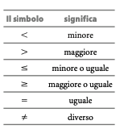
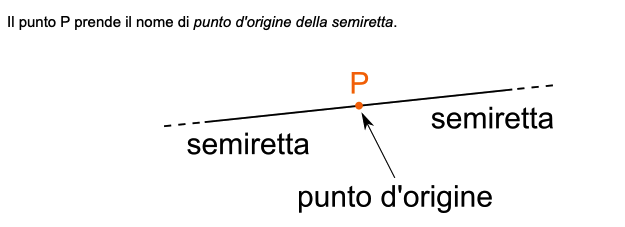
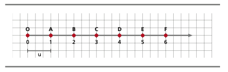
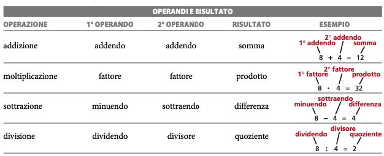
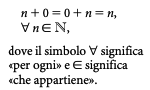
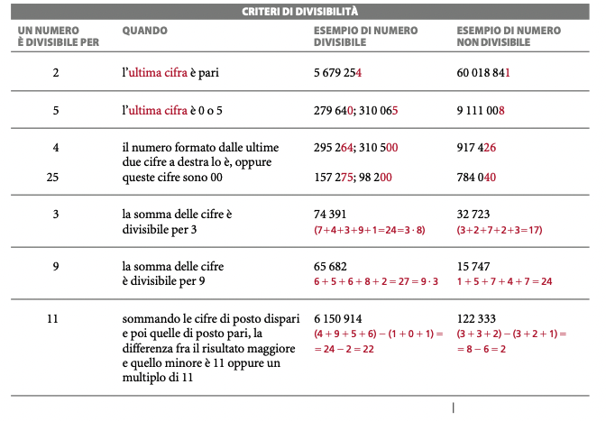

Ok, lo metto, comincia a salirmi un pò di ansietta per quanto riguarda il ricominciare con questo nuovo percorso. Negli ultimi mesi, tra le mille riflessioni, mi sono accorto di voler approfondire molti concetti che mi sarebbero stati utili per il mio lavoro.

Motivo per cui ho preso una scelta **difficilissima** : cambiare corso di studi e tornare a studiare informatica e matematica in modo approfondito. Mi sono infatti accorto di avere grandi carenze da questo punto di vista.



<iframe src="https://giphy.com/embed/ONGB9daIlcFTkbSqQp" width="100%" height="100%" style="position:absolute" frameBorder="0" class="giphy-embed" allowFullScreen></iframe>



Tuttavia, per poter affrontare il percorso con serenità, ho deciso che avrei quanto meno dovuto fare un ripasso generale di matematica di base.

E dato che questo blog è il luogo nel quale conservo quasi tutti i miei appunti e le mie riflessioni, ho deciso di pubblicare qui tutti gli appunti di **Matematica di Base** con la speranza che possano magari essere utili a qualcuno.

Concluse queste premesse, direi che possiamo anche cominciare subito.

## Qual'è la sorgente degli appunti

Ecco, qui un'altra doverosissima premessa. La maggior parte degli appunti provengono da libri delle scuole superiori. Dovrebbero quindi essere abbastanza comprensibili anche per chi è a digiuno di questi argomenti.

Tuttavia, potrei integrare quella risorsa con altre risorse esterne. Ma tranquillo, io non ricordo una fava, quindi sarà un percorso lungo e travagliato :)

---

## Che cosa sono i numeri naturali

Per farla breve, i numeri naturali sono questi: 1,2,3,4,5,6...

Sono quei numeri con i quali **impariamo a contare**. Entrano nelle nostre vite prestissimo e già da bambini (aiutandoci con le dita) siamo in grado di ripeterne almeno una decina 🙌🏻.

I numeri **naturali** sono **ordinati**, hanno cioè un'ordine ben preciso. Per intenderci, lo zero viene prima dell'uno, il successivo all'uno è il due e così via.

Questa cosa ha però delle **implicazioni.**

Dati **due numeri** **naturali** qualsiasi, possiamo sempre stabilire la relazione fra quest'ultimi: se uno è **maggiore** o **minore** di un altro o più semplicemente se sono **uguali** o **diversi**.

Per indicare la **relazione** che esiste fra due numeri naturali, utilizziamo in matematica i simboli di maggiore > o minore > ecc...

Nella tabella qui sotto, puoi vedere la lista ordinata dei vari simboli. Ma vabbè è abbastanza banale, quindi sono sicuro che tu li conosca.

Proprio perché i numeri naturali sono **ordinati** di ogni numero naturale (escluso ovviamente lo zero) esiste sempre il **precedente** e il **successivo**.

Questa è una cosa facile da comprendere, data la seguente lista di numeri naturali:

0,1,2,3,4,5,6,7,8,9,10

Se ne prendessimo uno a caso, ad esempio il 2, potremmo certamente affermare che il 3 è il numero successivo, mentre l'1 è il numero precedente.

Questa cosa non è possibile per lo **zero** che è praticamente l'elemento di partenza dell'insieme dei numeri naturali.

Per quanto riguarda quello, possiamo affermare con certezza che ha solo un numero successivo.

Per concludere quest'introduzione, l'**insieme** dei **numeri naturali** viene **indicato** con la **lettera N**.

Chiarito questo, dovrei aver capito cosa sono i numeri naturali. (bravo Enrico, non ci voleva molto 😊)

Ma andiamo avanti.

## La rappresentazione dei numeri naturali

Proprio in virtù del fatto, che i numeri naturali sono un'insieme ordinato (lo abbiamo visto sopra eh!) è possibile rappresentarli tramite una **semiretta orientata**

### Cosa diamine è una semiretta orientata?

Ora, me lo sono chiesto anche io. Non che concettualmente non riesca a visualizzare una semiretta, anzi, chiaramente però quest'ultima avrà una definizione e dato che il libro me l'ha girata così in modo semplice ho fatto delle ricerche.

**Wikipedia** riporta una definizione formale che ti risparmio, perché ci ho messo circa 20 minuti a leggerla bene. Ho trovato invece una definizione decente sul sito [youmath](https://www.youmath.it/domande-a-risposte/view/6180-semiretta.html) che ti riporto qui sotto.

> Si dice semiretta ciascuna delle due parti, in cui una **retta** è divisa da un punto.

Qui sotto un'immagine esplicativa della cosa:

---

---

Come puoi vedere, il punto P nell'immagine suddivide la **retta** in due **semirette distinte**.

A questo punto, se prendiamo una delle due **semirette** che si sono venute a creare e ne definiamo un **verso di percorrenza**, otteniamo una **semiretta orientata**.

A questo punto, per rappresentare i numeri naturali sopra la semiretta orientata, non ci basterà altro che definire un'unita di misura.

Il risultato è il seguente:



    
  



### L'insieme dei numeri naturali è discreto

Allora, sul concetto di insieme discreto, mi ci sto arrovellando da alcuni giorni, in quanto è parecchio complesso. Il libro di testo, partendo dalla rappresentazione ci dice semplicemente questo:

> I punti della semiretta sono molti di più di quelli che corrispondono ai numeri naturali. Per esempio, fra B e C vi sono infiniti punti che non rappresentano numeri naturali. Per indicarlo si dice che N è un insieme **discreto**.

Ora, buttata così un pò semplice, ma essendo un testo delle scuole superiori, chiaramente non mi aspetto questi approfondimenti.

Tuttavia, ho fatto alcune ricerche in riferimento al "concetto" di "discreto" in matematica.

Intuitivamente, possiamo riuscire a comprendere il concetto di discreto definendolo come un qualcosa costituito da parti isolate.

Nel caso dei numeri naturali, ad esempio, dato che fra il punto A (dello zero) e il punto B (dell'uno) sono presenti anche infiniti punti che non fanno parte però dell'insieme dei numeri naturali, allora è intuitivamente chiaro che l'insieme dei numeri naturali risulti **discreto**.

I vari punti sono infatti **isolati** sono cioè circondati da infiniti punti che non sono però numeri naturali.

E' come se l'insieme N fosse un'arcipelago di isole (dove ogni isola rappresenta un numero che fa parte dei naturali) circondate però da oceani di altre robe che non ne fanno parte.

In matematica tutto questo discorso a che fare con **topologia** e dato che io non sono abbastanza competente, accantono momentaneamente la questione per ritornarci dopo.

Se avessi link, appunti o approfondimenti sul tema, sappi però che mi interessano.

Condividimeli quindi su Telegram :)

## Le quattro operazioni nei numeri naturali

Nell'insieme dei numeri naturali si possono praticamente eseguire le quattro operazioni.

Nel contesto delle operazioni, i **simboli** utilizzati per le operazioni vengono detti **operatori**.

Stiamo naturalmente parlando dei classici simboli che ci vengono presentati alle scuole elementari (+,*,-,/) -> cioè non proprio questi per il* e l / ma da tastiera non posso fare molto altro.

Gli **operatori** agiscono sempre fra due **numeri** che vengono chiamati **operandi** e quest'ultimi producono sempre un **risultato**.

Fin qui, nessun concetto difficile, al più qualche concetto da ricordare. C'è da precisare però, che **operandi** e **risultato** assumono un nome diverso a seconda dell'operazione in cui vengono coinvolti.

Per semplicità ricopio qui la tabella del libro ma non è niente di complesso direi.

### Addizione e Moltiplicazione

L'addizione e la moltiplicazione sono **operazioni interne a N**. In parole povere, significa che ogni qualvolta eseguiamo una moltiplicazione o un'addizione fra due numeri naturali, otteniamo sempre un numero naturale.

Questo, come vedremo a breve non è vero per la sottrazione e la divisione che invece non sempre se eseguite riportano un numero che appartiene all'insieme dei numeri naturali.

### Le operazioni Inverse

La sottrazione, così come la divisione, vengono definite operazioni **inverse** in quanto la loro definizione dipende dall'addizione e dalla moltiplicazione e si comportano in modo contrario a queste due.

Anche in questo caso non è un concetto di difficile comprensione, ma si farà ancora più chiaro quando vedremo la definizione di queste due operazioni.

### La sottrazione

> La **differenza** (il risultato della sottrazione viene definito differenza, come da tabella sopra) fra due numeri è quel numero che, addizionato al sottraendo, da come somma il minuendo.

Ora, la comprensione di questa definizione è semplice, ma il mio consiglio è quello di riguardare la tabella sopra per i nomi degli operandi e del risultato.

Qui sotto ti lascio un'esempio contenuto nel libro che ti chiarirà il resto.



    
  



Ok, l'esempio sopra, chiarisce un bel pò di cose. Per primo, come vedi la sottrazione si comporta in maniera inversa rispetto alla divisione. In secondo luogo, come puoi leggere dalla definizione, la sottrazione viene definita partendo proprio dalla moltiplicazione.

Intuitivamente però, la cosa non mi sorprende. Se hai mai fatto un lavoro per il quale devi dare del resto alla gente che paga, avrai già sperimentato questo metodo. In genere, piuttosto che fare la sottrazione a mente, puoi procedere a sommare al sottraendo (quello che il cliente deve pagare) un'importo che ti consenta di eguagliare il minuendo.

Sempre come accennato sopra, la **sottrazione** non è un'**operazione** **interna** a N, in quanto il risultato della sottrazione non sempre è un numero naturale.

Più specificatamente la sottrazione è un'operazione interna a N quando il **sottraendo** è **minore o uguale** al **minuendo**.

Se ad esempio volessimo eseguire quest'operazione: 3-9 non otterremmo come risultato un numero naturale.

## La divisione

Anche in questo caso partiamo dalla definizione:

> Il **quoziente** fra due numeri è quel numero che, moltiplicato per il divisore, da come prodotto il dividendo. Quindi, perché la divisione abbia senso il divisore deve sempre essere diverso da 0.

Anche in questo caso notiamo che:

- La divisione è un'operazione contraria alla moltiplicazione
- La divisione viene definita sulla base della moltiplicazione

Nella **definizione** sopra, c'è però un'appunto finale: "perché la divisione abbia senso, il divisore deve essere sempre diverso da 0".

Questo è facilmente comprensibile, sappiamo tutti infatti che qualsiasi numero moltiplicato per 0 da come risultato 0, di conseguenza non esiste alcun numero che moltiplicato per 0 possa dare come prodotto il dividendo.

Lascio sempre un'esempio dal libro, che come al solito chiarisce un pò le cose:



    
  



Come per la sottrazione, anche per la divisione non sempre il **risultato** è un **numero naturale**.

Dobbiamo fare però una distinzione tra:

- Divisione con resto
- Divisione senza resto

Nei numeri naturali è infatti **sempre possibile** eseguire una **divisione con resto** in quanto questa tipologia di divisione restituisce sempre un numero interno a N.

Anche qui, stiamo parlando di concetti di scuola elementare. Le divisioni con resto direi che ce le ricordiamo tutti. Alcuni pure con nostalgia di quel periodo 😂.

Non aggiungerò quindi altro testo che altrimenti sarebbe ridondante.

La divisione ci fornisce comunque l'assist (o meglio lo fornisce al libro lol) per parlare di due numeri particolari appartenenti a N:

- 1
- 0

## Il numero 0

### Addizione e sottrazione con 0

Per quanto riguarda l'**addizione** lo 0 è detto **elemento neutro** in quanto sommato a qualsiasi numero da come risultato 0.

Questa relazione può essere espressa così:

Per quanto riguarda invece la **sottrazione**, quest'ultima non è possibile in N quando il minuendo è uguale a 0. Non otterremmo infatti un risultato appartenente all'insieme dei naturali.

**ESEMPIO:**
0-5 = impossibile in N, in quanto non esiste un numero che sommato a 5 dia 0.

Dato che qualsiasi numero **sommato** a 0 da come risultato il numero stesso, il risultato di una somma **può essere zero** se e solo se entrambi gli **addendi** sono 0.

Nella **sottrazione** invece, la **differenza** (risultato della sottrazione) è **zero** quando minuendo e sottraendo sono **uguali**.

### Moltiplicazione e divisione con 0

Nella **moltiplicazione** lo **zero** viene definito come **elemento assorbente**. Questo perché basta che anche solo uno dei fattori sia 0 per fare in modo che il risultato della moltiplicazione sia 0.

Questa proprietà dello 0 nella moltiplicazione viene in  espressa dalla **legge di annullamento del prodotto** che recita quanto segue:

 > Affinché un prodotto sia 0 è necessario e sufficiente che sia 0 almeno uno dei suoi fattori.

 Da questa legge possiamo ricavare due cose:

- Dato che è **necessario** che almeno uno dei fattori sia 0 per fare in modo che il prodotto sia uguale a 0, allora, nel caso in cui il risultato di una moltiplicazione sia uguale a 0 possiamo affermare con certezza che, uno dei due prodotti deve essere 0.
- Dato che è **sufficiente** che uno dei due fattori sia 0 affinché il prodotto sia uguale a 0, allora se in una moltiplicazione uno dei fattori è uguale a 0 allora il prodotto sarà certamente uguale a 0.

Estrapolare queste informazioni dalla legge di annullamento del prodotto è importantissimo per comprendere i concetti di **necessario e sufficiente** in matematica, dato che quest'ultimi ritorneranno spesso.     

Per quanto riguarda invece la **divisione** lo **zero** ha un comportamento diverso nel caso in cui quest'ultimo si trovi al **dividendo o al divisore**.

Se il **dividendo è 0** allora il **quoziente** sarà sicuramente 0. Questo è spiegato facilmente dalla **definizione stessa di divisione**, che abbiamo visto sopra. 

Il quoziente è infatti definito come quel numero che moltiplicato per il divisore da come risultato il dividendo.

Quindi se il dividendo è 0 dobbiamo trovare quel numero che moltiplicato per il divisore (qualsiasi esso sia) dia 0 (divisore) sicuramente quest'ultimo sarà 0. 

Ti ricordi la legge dell'annullamento del prodotto sopra? Se il risultato di una moltiplicazione è 0 allora sicuramente uno dei due fattori sarà 0 e dato che uno dei due fattori lo conosciamo (il divisore) allora il numero che cerchiamo deve essere per forza 0. 

**Esempio:** 0:18 = 0 -> X * 18 = 0 -> 0 * 18 = 0

Qui magari ci tornerò su nei prossimi giorni, tuttavia il concetto mi sembra abbastanza chiaro. 

L'unica cosa che rimane da aggiungere è che **non è possibile** la divisione con il **divisore uguale 0**. 

## Il numero 1

Nella **moltiplicazione** il numero **1** viene detto **elemento neutro**: moltiplicando infatti qualsiasi numero per 1 il risultato è il numero stesso. 

Nella **divisione** invece, le cose si complicano, ma non troppo. Quando il **divisore** è 1, il quoziente coincide con il **dividendo**. Quando è invece il **quoziente** (risultato della divisione) ad essere 1, allora significa che **dividendo** e **divisore** **coincidono**.

Se la vediamo a numeri, questa relazione è sicuramente più semplice da intuire di quello che si pensi. 

## Multipli e divisori di un numero
Ok, arriviamo ora ad un argomento che è in realtà abbastanza semplice da trattare: multipli e divisori di un numero. 

Qui possiamo procedere spediti, dando alcune definizioni ed una panoramica su alcune regole specifiche (che ti ricopio in toto dal libro).

Cominciamo dalla definizione di **multiplo**.

### Che cos'è un multiplo

> Un numero naturale è multiplo di un altro se la divisione del primo per il secondo dà come resto 0.

### Come capire se un numero è multiplo di un altro numero

Le divisioni con resto le abbiamo viste sopra e alle elementari, quindi qui non perderò molto tempo. Se vogliamo capire se un numero è multiplo di un'altro numero, ci basterà prendere il primo numero e dividerlo per il secondo. 

Se il risultato di quest'operazione è un numero senza resto, allora stiamo pur certi che quel numero è multiplo del secondo numero. 

### Trovare i multipli di un numero

E' possibile trovare tutti i multipli di un numero naturale, semplicemente moltiplicando quel numero per l'insieme dei naturali a partire da 1. 

Quindi se ad esempio volessimo calcolare tutti i multipli di 2 dovremmo fare: 

- 2*1= 2
- 2*2= 4
- 2*3= 6
- 2*4= 8
- 2*5= 10
- 2*11= 22
- ecc...

I multipli di un **numero** sono praticamente **infiniti.** Qui il libro non lo accenna sopra, ma l'insieme dei numeri naturali è un'insieme infinito. O almeno questo ricavo anche da quest'ultima affermazione eh. 

**ATTENZIONE:** l'unica eccezione a questa regola la fa lo 0 che ha come unico multiplo se stesso. Del resto, se anche moltiplicassimo zero per tutti i numeri naturali, otterremmo comunque 0 dato è un'elemento assorbente. 

### Che cos'è un divisore

>  Un numero naturale diverso da 0 è divisore di un altro numero naturale se la divisione fra quest’ultimo e il numero dato è esatta, cioè se la divisione dà come resto 0.

Il concetto di divisore, si intreccia con quello di multiplo. In generale se abbiamo due numeri naturali e la divisione fra questi è possibile e senza resto, allora potremo certamente affermare che: 

- Il primo numero è sicuramente multiplo del secondo
- Il secondo numero è divisore del primo. 

Ad **esempio:**

27/3 = 9 (Senza Resto)

Quindi, 27 è sicuramente multiplo di 3, mentre 3 è un divisore di 27. 

### Quanti divisori per ogni numero

Al contrario dei multipli di un numero che erano praticamente infiniti, i divisori non lo sono. 

Oltre a ciò il libro di testo presenta poi una tabella dei criteri di divisibilità di un numero che in realtà più o meno tutti conosciamo dalle scuole medie. 

La riporto comunque perché può essere utile: 

