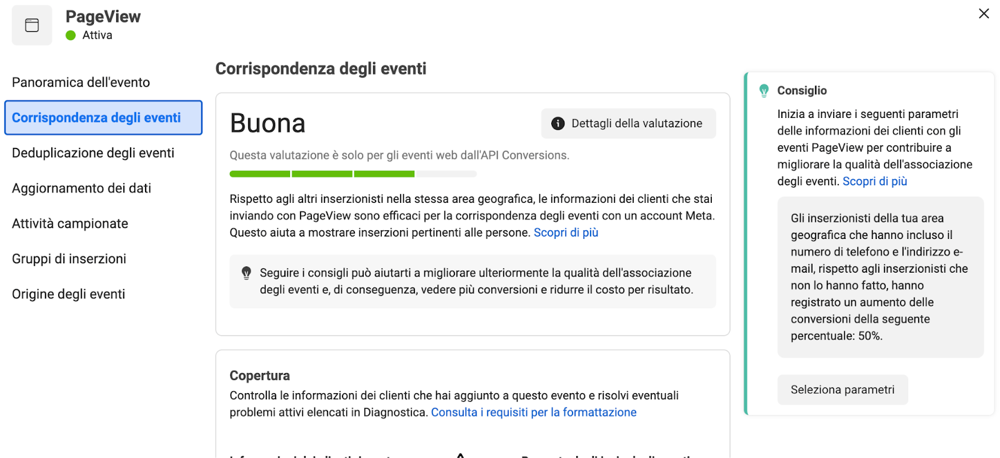
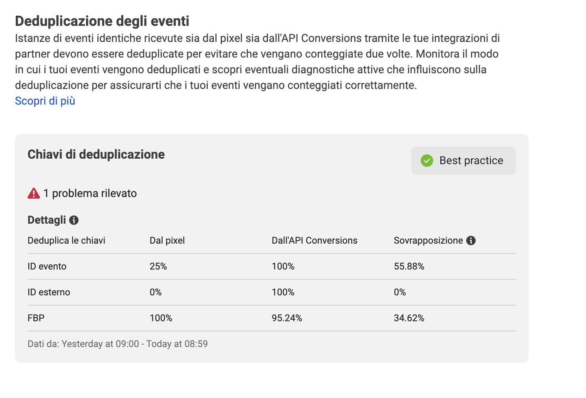
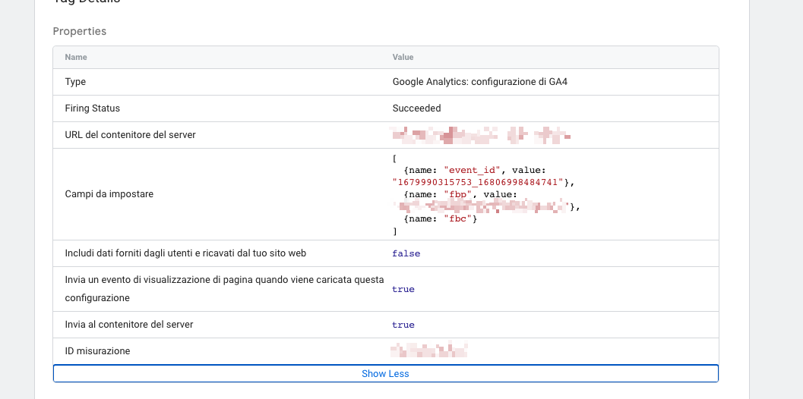
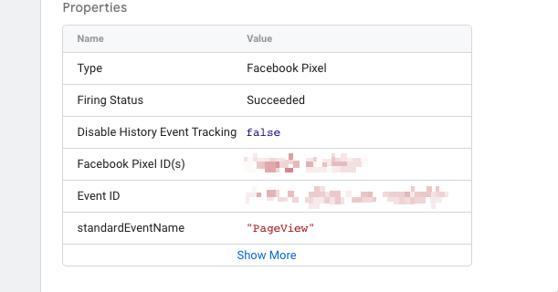
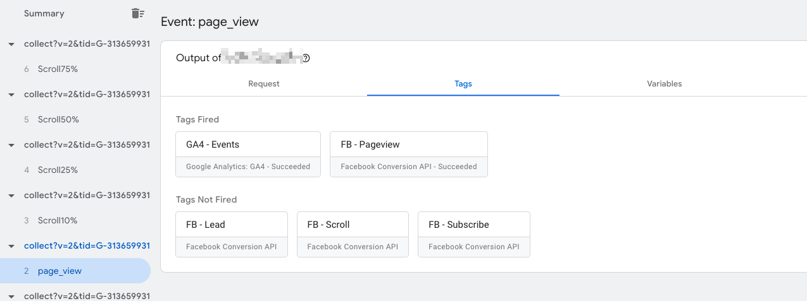
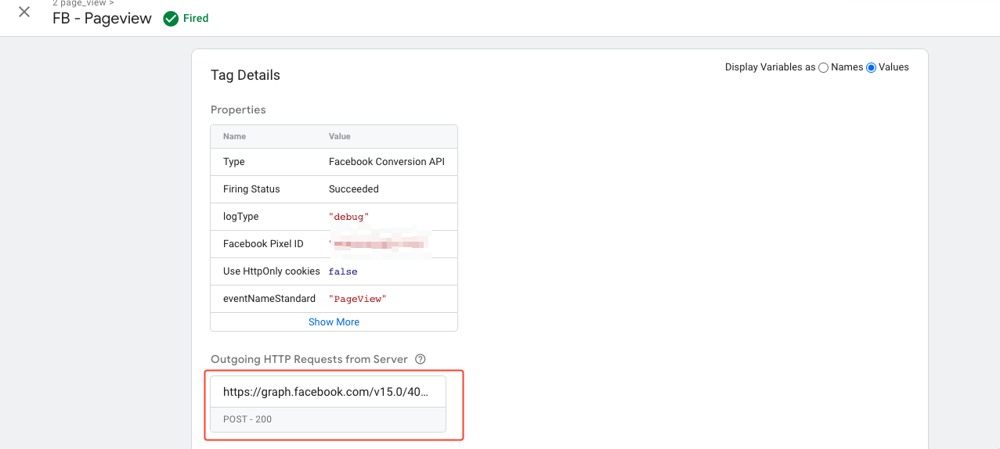
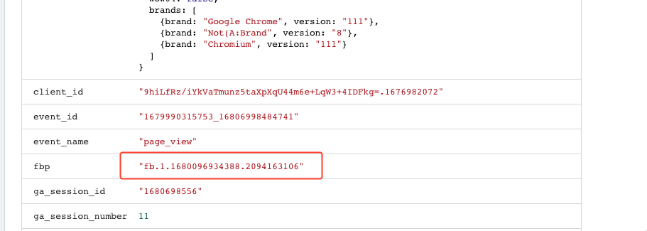
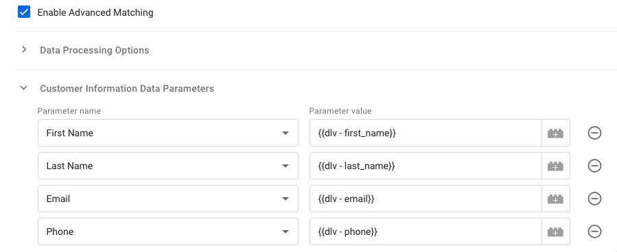

---

title: "Controllo CAPI con GTM Server Side (Stape.io)"
summary: "Qualche giorno fa ho fatto un controllo ad un implementazione delle CAPI. Ho messo un piccolo riassunto della lavorazione direttamente qui"
cover:
    image: "capi-facebook.png"
    caption: "Work In Public"
    alt: "Capi Facebook Stape"
    
date: 2023-04-04T11:30:03+00:00

categories:
    - "Work in Public"

tags:
    - "GTM Server Side"
    - "CAPI"
    - "Tracking Meta"
---
# Controllo CAPI con GTM Server Side

In questi giorni ho lavorato insieme ad alcuni colleghi/e ad un setting per l'implementazione delle CAPI tramite GTM server side. 

Non mi sono occupato direttamente dell'implementazione, per cui oggi dovrò verificare che tutti gli eventi siano stati correttamente settati. 

Vorrei portarti con me in questo semplice check per mostrarvi cosa guardo solitamente, come lo guardo e come valuto il setting di un container SS.

## Partiamo da “Events Manager”
Per prima cosa, partiamo subito da "Events Manager" di Facebook per verificare quali eventi sono stati catturati dal pixel, i punteggi di qualità e i valori relativi alla deduplicazione degli eventi.

Restringo il range temporale ai soli eventi avvenuti oggi per evitare di avere dati falsati o test non validi. Una volta fatto ciò, posso procedere a controllare ogni singolo evento, iniziando dal pageview. 
Ma cosa devo esattamente controllare?
### La discrepanza tra gli eventi browser e gli eventi server

Nei casi migliori, mi aspetto una corrispondenza 1:1 tra la linea blu (che rappresenta gli eventi del browser) e la linea verde (che indica gli eventi del server). 

In questo caso, noto che sono stati registrati più eventi del browser rispetto a quelli del server. 

Sicuramente è una cosa da controllare, ma lo valuterò nei test successivi. Per ora, cliccando su "Visualizza Dettagli", procedo con altri test.

Osservando gli altri eventi, ad esempio, possiamo notare come la sovrapposizione tra i due eventi è più incoraggiante. 

Il grafico del Pageview dovrebbe avere una struttura simile. Tuttavia, questa discrepanza potrebbe anche essere dovuta alla struttura del sito web.

Effettuerò però un check più approfondito di tutto tramite GTM. 
### La corrispondenza degli eventi

La corrispondenza degli eventi è un valore particolare che va preso con le pinze. Purtroppo, non ho ancora scritto un post dettagliato sull'argomento. Tuttavia, tale valore è condizionato dal numero di informazioni utente inoltrate insieme all'evento. Nel caso specifico di un semplice pageview, non abbiamo a disposizione molte informazioni sull'utente. 

Se l’utente non è loggato non posso sapere il suo nome o il suo indirizzo. Le uniche cose che posso sapere di lui sono l’indirizzo ip o il suo user agent, oltre naturalmente all’id browser e click di Facebook. 

Le informazioni inoltrate sono le seguenti: 
* Indirizzo IP
* User Agent
* ID Esterno
* ID Browser
* FBP
* FBC

Idealmente sono più che buone per questo tipo di evento e mi può andare bene così. 
### Deduplicazione degli eventi

La deduplicazione degli eventi rappresenta un aspetto fondamentale da considerare quando si effettua il tracciamento lato server per Facebook. È importante notare che durante questo processo, inviamo sia un evento lato browser che un evento lato server, ma questi due eventi rappresentano effettivamente un singolo evento. Di conseguenza, dobbiamo aggiungere uno o più parametri al Pixel per permettere a Facebook di comprendere che si tratta dello stesso evento.

In questo caso, la percentuale di eventi Pixel con un ID evento è un po' bassa e questo solleva alcune preoccupazioni. Pertanto, effettuerò un controllo sulla corretta compilazione di quell'evento.
### La frequenza di aggiornamento dei dati

L’altro dato più importante è la frequenza di aggiornamento dei dati. Non è detto che gli eventi lato server arrivino necessariamente in tempo reale, ma è di certo meglio che sia così. 

In questo caso, gli eventi lato server arrivano in tempo reale di conseguenza è un dato certamente positivo, che dimostra il fatto che il server è abbastanza sano, almeno per l’evento pageview. 
### Check su tutti gli eventi
Ho eseguito questi check su tutti gli eventi, raccogliendo un pò di impressioni sullo stato di salute dei vari eventi. Ad esempio durante questo check sono sorte alcune perplessità su: 
* La gestione dell’evento page_view
* La mancanza di alcuni parametri negli eventi
## Test su GTM
Una volta completato il controllo sugli eventi da Business Manager, sono passato ad un check degli eventi all’interno di Google Tag Manager. 

In questo caso, trattandosi di un setting su server side, dobbiamo mandare in anteprima entrambi i container: quello lato browser e quello lato server. 

Da qui, analizzando gli eventi e i tag inoltrati, procedo ad effettuare reverse engineering di quello che viene attivato sul container, a partire dall’evento pageview. 

Una volta che il container viene caricato, vengono attivati i seguenti tag: 
* Il linker conversioni
* Il tag di remarketing di Google ADS
* Il tag di Hotjar
* Il tag di configurazione di GA4
* Il tag di installazione del pixel e dell’inoltro del Pageview
* Uno script che serve ad inoltrare un evento Search nel caso in cui l’utente utilizzi la barra di ricerca sul sito web. 

⠀Controllo tag di configurazione di GA4

Il tag di configurazione di GA4 raccoglie i parametri principali inseriti, come l’event_id (che inoltriamo poi al container server side) e il valore del cookie fbp. 

### Confronto Event ID GA4 con Event ID Facebook
Procedo quindi a confrontare l’id evento di GA4 con l’ID evento del Pixel in modo da assicurarsi che si tratti dello stesso valore. L’event ID di GA4 sarà infatti quello trasmesso al container server side e quindi trasmesso tramite evento server a Facebook. 

### Controllo tag container server side

Ho quindi effettuato un check sui dati raccolti dal container server side in modo da verificare che anche lì i dati venissero trasmessi in maniera corretta. 
In particolare ho effettuato i seguenti controlli:

#### Controllo della richiesta

Per prima cosa, ho fatto un check della richiesta. Cliccando sull’elemento evidenziato nello screenshot è infatti possibile controllare sia i dati della richiesta che la risposta di Facebook (in questo caso). 

In questi casi, in particolare effettuo un check dei parametri inviati e della corrispondenza dell’event_id con quello inoltrato dal tag Facebook sul container lato browser, quindi procedo a fare un check sulla risposta del server si Facebook. 

In caso di problemi, troverei nella response body i vari codici di errore.

Questo check l’ho naturalmente effettuato su ognuno degli eventi tracciati nel container. (Si, ci vuole un pò di tempo -.-).
## Interventi Effettuati
Qui la lista degli interventi eseguiti sul container di GTM al fine di migliorare decisamente la qualità dei dati raccolti dal Pixel. 

### Recupero di _fbp e _fbc per l’inoltro al server
I parametri _fbp ed _fbc sono utili per aumentare il punteggio di qualità dei vari eventi. Di conseguenza è estremamente utile inoltrarli agli eventi lato server. Nonostante l’fbp viene comunque recuperato ed inoltrato quasi in automatico, preferisco recuperarlo direttamente dal Cookie. 

Entrambi i parametri sono infatti conservati nei cookie del browser dell’utente.

Quindi ho aggiunti i due parametri agli eventi GA4 che si occupano di comunicare con il server. 

Quindi ho recuperato il valore FBP dal container lato server in modo da poterlo inoltrare ai vari eventi lato server. 

Dato che sul container lato server utilizziamo il tag di stape.io, ho inserito i due parametri all’interno dei campi “User Data” dei vari tag. 

### Modifica ID Stream GA4
Modificato l’ID Stream di GA4 che non risultava corretto. Era già presente una variabile settata dal cliente, ma quest’ultima non aveva un valore reale. Ho quindi provveduto a modificare la variabile. 

### Cambio pagina asincroni
Sempre dal test tramite GTM ho notato che alcuni cambi di pagina avvengono in asincrono. Questo significa che non avviene un effettivo caricamento della pagina, ma un banale refresh di quello che è visualizzato. 

Ho quindi sfruttato l’inoltro dell’evento aggiungendo un trigger ai tag di visualizzazione di pagina sia di Facebook che di GA4.

### Dati utente sull’evento Lead
Sull’evento Lead, venivano inoltrati a GA4 tutta una serie di informazioni utente che non erano però state condivise né con il tag lato browser di Facebook, ne con il tag lato server si GADS. 

Ho quindi provveduto a recuperare le variabili sul container server in modo da poter inoltrare le informazioni utente. 

Per sicurezza, ho inoltrato le stesse informazioni anche all’evento lato browser. 

### Altri piccoli errori
A parte questo, sul setting risultavano presenti piccoli errori di distrazione, ma nulla di invalidante. Ho ad esempio sistemato la nomenclatura di alcuni tag ed il nome di alcune variabili. 

Nulla che non vada, ma la nomenclatura su di un container di GTM è davvero importante, soprattutto se tornerai a lavorare su quel container dopo tanto tempo. 

Si, sono un rompiscatole rispetto a questi temi, ma davvero credo che nel lungo periodo faccia la differenza. 

## Controllo Test Event
Dopo aver effettuato tutte le modifiche e le azioni correttive, al fine di effettuare un ultimo check della configurazione, ho effettuato un test tramite il tool “Testa gli eventi” di facebook, in modo da verificare in real_time l’inoltro degli eventi. 

Naturalmente ho recuperato il test event code dall’interfaccia e l’ho caricato sui tag del container lato server, in modo da poter debuggare anche quelli. 

Dal mio controllo finale, tutti gli eventi sono stati ricevuti correttamente e correttamente deduplicati da Facebook. Di conseguenza, ho potuto mettere in pausa il tutto al fine di verificare successivamente nei prossimi giorni. 

Perché una successiva verifica? Perché non si è mai abbastanza tranquilli e di conseguenza è meglio lasciare che facebook raccolga un paio di giorni di dati e da lì effettuare un test più veloce. 

