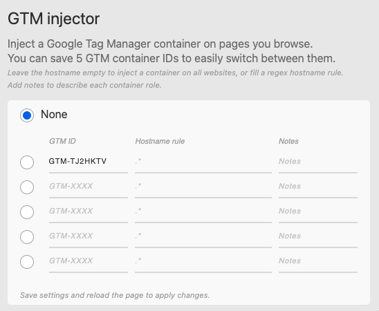

---

title: "Installare un container GTM su qualsiasi sito web"
summary: "Ho fatto un lavoro di tracciamento su di un sito web cui non avevo alcun accesso. Ci sono riuscito grazie all'inject del container e dato che è estremamente utile, vediamo insieme come fare."
cover:
    image: "wip.png"
    caption: "Work In Public"
    alt: "Inject Container GTM"
    
date: 2023-04-07

---

Benvenuti alla nuova sessione di "Work In Public", l'esperimento che sto portando avanti da qualche giorno. Se non l'avete ancora fatto, consiglio di dare un'occhiata al primo articolo che ho pubblicato sulla gestione dei tag tramite GTM Server Side. Fatemi sapere se vi è piaciuto! 😊

Oggi voglio parlarvi del lavoro di tracciamento che ho svolto nella scorsa settimana. Nonostante non fosse particolarmente complicato, si è rivelato un lavoro problematico. Il cliente non era infatti in grado di fornirmi gli accessi alle diverse risorse: GTM, Analytics, sito web, ecc. 

Ho dovuto quindi effettuare il lavoro di tracciamento senza la possibilità di accedere alle piattaforme, il che ha reso il processo un po' più complicato. Fortunatamente, si trattava di aggiungere solo degli eventi che non erano presenti e non di modificare un tracciamento già esistente. Questo, mi ha semplificato non poco la vita. 

Per superare queste difficoltà, ho deciso di iniettare il mio container di GTM ed effettuare il setting dei vari tag direttamente da lì. In questo modo ho aggirato il problema ed ho portato a casa il lavoro 🚀

La soluzione che ho trovato può essere utile in tutte quelle situazioni in cui non è possibile accedere al container installato sul sito web (per vari motivi). Vorrei quindi condividermi tutto il processo, in quanto penso possa essere istruttivo per tutti.

Bene, se siete pronti, direi di cominciare. 

## Come funzione l’Inject del container
Iniettare il container su un sito web non significa installare permanentemente un container alternativo. Il nostro container viene installato temporaneamente durante la sessione di navigazione con il nostro browser.

Questa soluzione offre un modo semplice e immediato per osservare le chiamate a Google Analytics e gli eventi nel dataLayer (cosa che potremmo fare anche con tag assistant eh) e inoltre ci consente di far scattare i nostri tag sul sito web. 

In sintesi, l'inject del container rappresenta una soluzione semplice ed efficace per monitorare e verificare il tracciamento su diversi siti web.

## Come iniettare un container di GTM custom
Esistono diverse metodologie per l'iniezione di un container di GTM, ma personalmente preferisco utilizzare la funzione di Inject di "[DataLayer Checker](https://chrome.google.com/webstore/detail/datalayer-checker/ffljdddodmkedhkcjhpmdajhjdbkogke)" 

DataLayer Checker è un'estensione del browser che permette di visualizzare tutti gli eventi inoltrati al nostro dataLayer. Inoltre, offre anche la possibilità di iniettare un container di GTM sui siti web visitati.

Di default, l’estensione si presenta così e ci consente di visualizzare tutti gli eventi pushati all’interno del dataLayer.

Tuttavia, facendo click sul pulsante di setting in alto a destra, ci vengono fornite una serie di opzioni. Tra cui, la possibilità di effettuare l’inject di un container GTM all’interno di qualsiasi sito web.

Per farlo, basta inserire l’id del container nel campo **GTM ID** e se lo vogliamo possiamo anche definire delle regole riguardo all’hostname di attivazione. 

Una volta inserito l’ID ci basterà fare click sul check a sinistra dell’ID del container e salvare le impostazioni. 

In questo modo, potremo utilizzare il nostro container su qualsiasi sito vogliamo, gestendo tag, eventi e tanto altro. 

Nello screenshot sotto, ad esempio, ho iniettato il mio container sulla home page di Google.

## E una volta completato il tracciamento?
Beh, in questo caso, una volta completato il tracciamento ho banalmente eseguito un’export del mio container da caricare sul container principale. 

In questo modo, i miei tag hanno fin da subito cominciato a funzionare in modo corretto. Come accennavo all’inizio, si tratta di una soluzione estremamente semplice e comoda, ma che ovviamente non è sempre fattibile. 

In caso di tracciamenti più complessi su siti web che hanno già effettuato un primo tracciamento iniziale, effettuare una lavorazione esterna non sarebbe proprio l’ideale. Tuttavia, nelle situazioni più semplici è fondamentale. 

E con questo è tutto. Spero che vi divertirete ad iniettare container in giro per il web e ci vediamo nel prossimo blog post. 